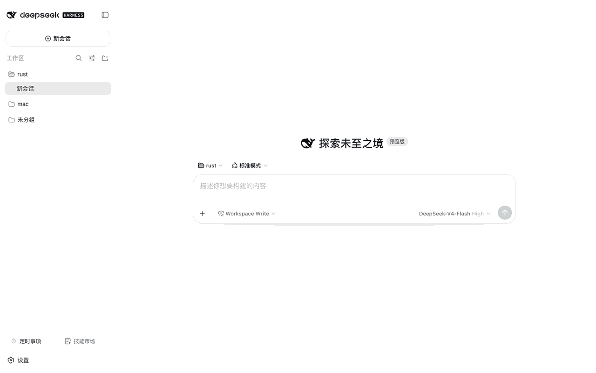

# @weibaohui/dsh-tasks

[](https://github.com/topics/dsh-plugin)
[](https://www.npmjs.com/package/@weibaohui/dsh-tasks)

**定时任务插件**：用 cron 表达式定时执行提示词——到点自动开一个新 agent 会话替你干活，也可以随时手动立即执行。



## 核心功能

- **cron 定时执行**：每个任务 = 标题 + 提示词 + cron 表达式；到点自动新建 agent 会话并提交提示词，执行结果出现在侧栏对应工作区下
- **可视化定时选择器**：快捷模板（每天 9:00 / 工作日 8:30 / 每周一 10:00 等）一键填入，也可按「每小时 / 每天 / 每周」逐级选，或直接填写自定义 cron；选定后实时预览**最近 5 次执行时间**，周期对不对一眼确认
- **手动立即执行**：任意任务可一键「立即运行」，不必等 cron 到点
- **绑定工作区**（可选）：任务可指定工作区，会话自动挂到该工作区并继承其目录
- **会话自动命名**：执行出的会话以「任务标题 · 时间」命名，同一任务多次运行在侧栏也能一一区分
- **完整管理界面**：全屏管理页——新建/编辑/启用停用/删除/立即执行，一页搞定
- **cron 校验**：保存时即时校验表达式，写错进不来
- **执行记录**：每个任务保留最近 20 次执行历史（时间、成败、失败原因），面板可展开追溯；无人值守跑完随时回看

## 安装

```bash
dsh plugin --profile web add @weibaohui/dsh-tasks -w
```

装完重启 `dsh web` 即生效。

## 使用

1. 打开 Web UI → 侧栏底部 **定时任务** 按钮，进入管理页（设置页也有同款面板）
2. **新建任务**：填标题、提示词、cron 表达式（如 `0 9 * * 1-5` 工作日每天 9 点），选择是否绑定工作区
3. 启用后按 cron 自动执行；列表里可随时 **立即执行**、编辑、停用或删除
4. 执行产生的会话在侧栏对应工作区下可见，点进去查看 agent 干活的过程与结果

## 示例

| 场景 | 提示词示例 | cron |
|---|---|---|
| 每天早上整理待办 | 「汇总我昨天的会话，整理今日待办清单」 | `0 9 * * *` |
| 工作日晚间日报 | 「总结今天的代码提交与会议要点，输出日报」 | `0 18 * * 1-5` |
| 每周知识沉淀 | 「回顾本周对话，把可复用的经验整理成文档」 | `0 20 * * 5` |

## 联系我 :飞书群


